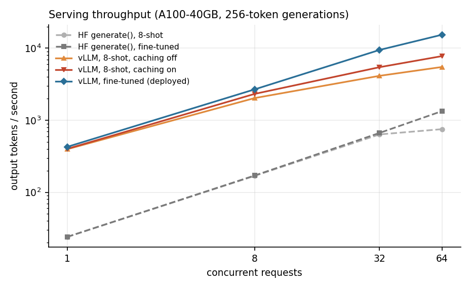
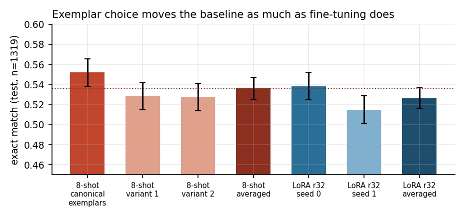
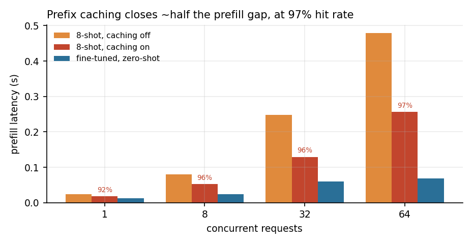

# LoRA fine-tuning vs 8-shot prompting on GSM8K

Does parameter-efficient fine-tuning beat few-shot prompting for grade-school
math on a small base model — and what does serving the result cost?

**Model:** `Qwen/Qwen3-0.6B-Base` · **Data:** GSM8K · **Adaptation:** LoRA SFT
(ranks 8/16/32 × 2 seeds) · **Serving:** HF `generate()` vs vLLM at concurrency 1–64

---

## Result

**On accuracy the two methods are indistinguishable. On serving cost they are
not: the fine-tuned model sustains ~2× the throughput, because it carries no
~900-token demonstration prefix.**

### Accuracy — test split, n = 1319, evaluated once

| System | Exact match | vs baseline | 95% CI | p |
|---|---|---|---|---|
| 8-shot prompting, averaged over 3 exemplar sets | **0.5360** | — | — | — |
| LoRA r32, averaged over 2 seeds, zero-shot | **0.5265** | −0.0095 | [−0.029, +0.011] | 0.382 |

**Format adherence** — produced a parseable `#### <answer>`: 0.9545 → **0.9913**,
difference +0.0368, CI [+0.025, +0.049]. The one large, unambiguous accuracy-side
effect, and it holds on both splits.

### Serving — A100-40GB, 256-token generations

Output tokens/sec:

| Stack | Model | c=1 | c=8 | c=32 | c=64 |
|---|---|---|---|---|---|
| HF `generate()` (static batching) | 8-shot base | 24 | 169 | 636 | 752 |
| HF `generate()` (static batching) | fine-tuned | 24 | 171 | 667 | 1,339 |
| vLLM, prefix caching **off** | 8-shot base | 397 | 2,033 | 4,141 | 5,494 |
| vLLM, prefix caching **on** | 8-shot base | 401 | 2,323 | 5,458 | 7,778 |
| vLLM, prefix caching on | **fine-tuned** | **427** | **2,684** | **9,471** | **15,402** |



At concurrency 64 the fine-tuned model is **1.98×** the throughput of the 8-shot
baseline *with prefix caching already enabled*. At a production-shaped 64-token
generation length the gap widens to **2.28×** — shorter outputs amortise prefill
over fewer decode steps, so the prompt-length penalty bites harder.

---

## What the numbers cost to believe

Three findings mattered more than the headline, and each came from checking
something that could have been left unchecked.

### 1. The comparison was unfair until we varied the prompt

The baseline used one arbitrary set of eight exemplars, chosen at the start and
never questioned. Swapping them, same model, same 1319 questions:

| exemplar set | test accuracy |
|---|---|
| canonical (originally reported) | 0.5519 |
| variant 1 | 0.5284 |
| variant 2 | 0.5277 |



**Exemplar choice is worth 2.4 points** (p = 0.036, 0.041), and the arbitrary
original set happened to be the best of the three. Against that single set,
fine-tuning appeared to *lose* by 2.5 points, p = 0.044 — significant. Against
the exemplar-averaged baseline the deficit falls to 0.9 points, p = 0.382.

**The original finding was an artifact of an unexamined prompt-design choice.** A
quantity you fixed arbitrarily and never varied is not a reference point.

### 2. Rank bought a better fit and no better answers

| Rank | Trainable params | Final train loss | Val accuracy |
|---|---|---|---|
| 8 | 5.0M (0.84%) | 0.513 | 0.6180 |
| 16 | 10.1M (1.67%) | 0.496 | 0.6180 |
| 32 | 20.2M (3.28%) | 0.477 | 0.6273 |

Training loss falls monotonically with capacity while accuracy does not move. SFT
maximises the likelihood of GSM8K's reference solutions; nothing in that objective
rewards being correct. The model got better at sounding like the dataset.

### 3. The winner's curse, on schedule

Rank 32 / seed 1 was the **best** config on validation (0.6347, highest of six)
and the **worst** on test (0.5148, −12.0 points). Its sibling seed, identical
configuration, scored 0.6200 on validation — so luck alone moved that number by
1.5 points, and the maximum of six noisy measurements is high partly *because* it
got lucky.

Selection therefore used **seed-averaged accuracy per rank**, and both seeds of the
selected rank went to test. Selecting on single-run validation maximum would have
published a number inflated by ~12 points.

### And the aggregate tie hides churn

On test, the baseline and LoRA r32 seed 0 disagree on **322 of 1319 questions
(24%)** and trade wins almost evenly — 170 baseline-only against 152
fine-tuned-only. These are not the same model reaching the same answers. Two
summary statistics would have hidden that entirely.

---

## Predictions, scored

Four predictions were committed to `results/benchmark_predictions.md` **before
`benchmark.py` was written** — the ordering is in the git history. Two were wrong.

**1. "Prefix caching mostly closes the 8-shot prefill gap." — FALSIFIED.**

| concurrency | APC off | APC on | zero-shot | gap closed |
|---|---|---|---|---|
| 1 | 0.024 s | 0.018 s | 0.012 s | 53% |
| 8 | 0.080 | 0.053 | 0.024 | 48% |
| 32 | 0.248 | 0.129 | 0.060 | 63% |
| 64 | 0.478 | 0.257 | 0.069 | 54% |



Caching closes about half. It survives at a measured **96.8% cache hit rate**, so
this is not caching failing to engage — the mechanism was misunderstood. Prefix
caching stores the prefix's keys; it does not stop new tokens from *attending
across* them.

**2. "The decode penalty persists regardless of caching." — CONFIRMED.** At
concurrency 64, decode time (p50 minus prefill) is 1.845 s for 8-shot cached
against 1.004 s zero-shot.

**3. "Throughput direction unknown."** — recorded as a genuine unknown so it could
not be retrofitted. Prefill savings dominate: caching lifts throughput 42%.

**4. "The HF-vs-vLLM gap widens with concurrency." — FALSIFIED, backwards.** The
ratio *narrows*: 17.8× → 15.7× → 14.2× → 11.5×. HF is already catastrophic at
concurrency 1 (24 tok/s) because per-token Python overhead dominates a 0.6B model;
batching amortises that, so HF improves faster than vLLM does.

### One more measured result worth stating

Peak GPU memory at concurrency 64 on the HF stack: **29.9 GB for 8-shot against
9.2 GB zero-shot**, from padding 64 × ~1100-token prompts. It is also why `hf_8shot`
latency jumps from 12.9 s to 21.8 s between concurrency 32 and 64 while the
zero-shot arm stays flat. (The vLLM arms all read ~37.9 GB because vLLM
preallocates 85% of the device regardless; that figure says nothing about need.)

---

## Method

### One text format everywhere

```
Question: <question>
Answer: <chain of thought>
#### <final numeric answer>
```

The baseline prepends eight worked examples in this format; the fine-tuned model
sees the same template with none. A single answer extractor scores both, so the
comparison cannot be confounded by one system's output being easier to parse.

Extraction reads the text after `####`, falling back to the last number. The
fallback matters — an unadhering base model often trails off without the marker,
and without it we would score format failures as wrong answers and conflate the
two metrics. `well_formed` tracks the marker separately.

### Splits

The official train split is shuffled once with a fixed seed, independent of any
training seed, and cut at **fixed** boundaries:

| Split | Size | Use |
|---|---|---|
| few-shot exemplars | 8 | demonstrations for the baseline prompt |
| validation | 750 | all rank and seed selection |
| train | 6715 | LoRA SFT |
| test (official) | 1319 | evaluated **once**, on the selected config |

Boundaries do not depend on how many demonstrations a prompt uses. Every system is
scored on an identical validation set, and no run trains on a question another run
is evaluated on.

### Statistics

Two systems answering the same questions are not independent samples: most
questions are easy for both or hard for both, and only disagreements carry
information. `src/stats.py` runs a **paired bootstrap** — resample *questions*
10,000 times, recompute the accuracy difference on each resample. An interval
containing zero means the systems are indistinguishable on this data.

The interval covers uncertainty over which questions are on the exam. It does
**not** cover seed-to-seed training variation, which here is comparable in size —
hence per-seed rows alongside seed-averaged ones.

### Training

LoRA SFT via TRL, one YAML per run. Loss on the completion only — question tokens
masked out, since we are teaching the model to answer rather than to write GSM8K
questions. **`alpha = 2r` across all ranks**, so the ablation varies capacity rather
than effective learning rate. LR 2e-4, 2 epochs, batch 16, cosine schedule. Dtype
selected at runtime (bf16 where supported, fp16 on Turing).

### Benchmark

Five configurations at concurrency 1/8/32/64. The **prefix-caching off/on pair**
is what makes a caching claim attributable rather than confounded with continuous
batching and PagedAttention.

The HF arm is **static batching, closed-loop**: N prompts padded to the longest,
one `generate()` call, all returning together, every request present at t=0. That
is the strongest honest HF baseline — serialised requests would hand vLLM a
factor-of-N win for the trivial reason that we declined to batch.

Every request generates exactly `max_new_tokens`, EOS ignored and stop strings
disabled on both stacks. The fine-tuned model is trained to stop early, so natural
stopping would credit it with latency wins belonging to the model rather than the
stack, confounding the prompt-length effect with an output-length effect.

---

## Five bugs found, and what they cost

Each was found by checking something that looked fine.

**1. Split boundaries depended on the shot count.** `"val": shuffled[n_shots : n_shots + val_size]`
meant the 8-shot baseline was scored on `shuffled[8:758]` and the zero-shot
fine-tuned evaluations on `shuffled[0:750]` — two validation sets differing by
eight questions, silently intersected by the bootstrap. Worse, the fine-tuned
training set began at index 750 and so contained eight of the baseline's
validation questions. All six runs were **retrained**, not merely re-scored.
`stats.align()` now refuses mismatched question sets rather than intersecting them.

**2. The vLLM engine was constructed inside the chunk loop.** A 750-example
evaluation paid ~40 s of startup twelve times (732 s → 77 s once fixed) and
reported near-zero GPU memory because the engine was already gone when memory was
read.

**3. Evaluation resume matched on question id alone.** Re-running with a different
adapter or shot count would silently have kept the previous run's generations.
Predictions now carry a fingerprint of every field that determines output.

**4. HF token counting was inflated.** It multiplied the batch's longest generation
by batch size, so any sequence finishing early flattered HF throughput.

**5. The benchmark warmed up on the prompts it then timed.** With prefix caching
on, that leaves whole prompts cached rather than just the shared prefix — the
zero-shot arm, whose prompts share almost nothing, reported a 73% hit rate. Warmup
and the prefill probe now use disjoint prompts; the zero-shot arm now reads 0.000
at concurrency 1, as it should. Timings moved by ≤2%, so the conclusions were
unaffected — but the hit rate could not have supported a caching claim.

Four of the five are the same failure mode: **a silent merge where there should
have been a refusal.**

---

## Why fine-tuning did not win

The obvious explanation — that GSM8K's terse reference solutions taught the model
to reason more briefly — **does not hold up**. Measured on test: 7% fewer generated
tokens, identical median reasoning steps (3 vs 3), and accuracy differences by
problem length of +0.000, −0.054, +0.007, +0.000. If reasoning had been damaged,
hard problems would suffer most. They did not.

What survives:

**The base model already knew this.** Qwen3-0.6B-Base was pretrained on far more
mathematics, better written, than GSM8K's 7,000 terse solutions contain.

**The objective is not accuracy.** SFT maximises next-token likelihood on reference
text. The rank ablation is direct evidence: loss down, accuracy flat.

**8-shot prompting is a strong intervention.** ~900 tokens of worked arithmetic in
context before every question is not a formality.

### The validation-to-test drop

Every system fell ~7 points from validation to test. Difficulty mix explains almost
none of it: the splits have near-identical solution lengths (mean 3.59 vs 3.65
steps), and reweighting test accuracy to the validation difficulty mix moves the
baseline only from 0.5519 to 0.5587 — 0.7 of the 7.2-point gap. The remainder is a
genuine distribution shift between GSM8K's train and test splits that solution
length does not capture. Because it hit all systems similarly, the comparison
survives.

---

## Scope and caveats

**Is 55% a sane number?** The Qwen3 technical report lists **59.59** for
Qwen3-0.6B-Base on GSM8K. Our 8-shot baseline at 55.2% under a different harness,
prompt format and extractor is in the right neighbourhood; several people have
opened issues reporting difficulty reproducing the published figure exactly.
Frontier models sit in the 90s — but the absolute number is not what this measures.

**The baseline is a control, not a target.** This measures a *difference* between
two adaptation methods on one model. On a model scoring 90%, both arms would score
near 90% and it would be the same comparison.

**Accuracy near 50% is where binomial variance is largest.** Part of why the
intervals are as wide as they are, and part of why an exemplar-choice effect was
large enough to overturn the original finding.

**The conclusion is scoped to a model already competent at the task.** The finding
is *"parameter-efficient fine-tuning on a benchmark's own training set adds little
to a model that can already do the benchmark"*, not *"fine-tuning does not work"*.
On a model that genuinely cannot do the task, SFT would very likely help a lot.

### Benchmark limitations

**Generation length is unrealistic, deliberately.** 256 tokens forced, against ~63
median real generations. That overweights decode relative to prefill — the exact
axis the prefix-caching prediction sits on. Right for isolating the mechanism,
wrong for describing production cost, so a 64-token check is reported alongside.

**p95 at n = 64 is the third-worst observation**, not a stable percentile. Tables
lead with p50 and max.

**Per-request latencies were not obtainable.** vLLM's offline `LLM` API does not
populate `RequestOutput.metrics`, with or without `disable_log_stats=False`. Every
request is therefore charged its round's completion time — exact for static
batching, where all requests genuinely finish together, and conservative for vLLM,
which finishes some earlier and gets no credit. Since vLLM is the arm expected to
win, the bias works against the conclusion. Obtaining real per-request times needs
the async engine; that rewrite was declined at the end of the project rather than
shipping a flat distribution and letting a reader assume it meant something.

**TTFT is a prefill-latency proxy** — a separate `max_new_tokens=1` call, not a
streamed first token, because batched HF `generate()` cannot report per-sequence
first-token times. One definition across both stacks was worth more than a truer
measurement on only one.

---

## What is deployed, and what was verified

The benchmark chose the deployment, not the original plan: **the merged fine-tuned
model, served zero-shot on vLLM.** It matches 8-shot prompting on accuracy, emits a
parseable answer 99% of the time against 95%, and sustains ~2× the throughput.

The service returns the *extracted numeric answer* through the same code path the
evaluation used — a service whose parsing disagreed with the benchmark's would be
reporting accuracy it does not have.

Three claims, stated separately because only two of them were tested:

**CPU image — built and verified end to end.** 1.96 GB. Container starts, `/health`
responds, `/solve` returns an extracted answer over HTTP. Both paths exercised:
`SHOTS=8` (returns `72`, well-formed, 1100 prompt tokens) and `SHOTS=0`, the
deployed code path, which starts without touching GSM8K.

**GPU serving code — verified on Colab, uncontainerized**, against the real merged
weights:

```
health: {"status":"ok","model":"merged/lora_r32_seed0","backend":"vllm","shots":0}
answer  : 72  (gold 72)     formed: True     prompt tokens: 38     latency: 203 ms
```

**GPU image — builds only; runtime unverified.** The pinned base tag
`vllm/vllm-openai:v0.28.0` was confirmed to exist and publish `linux/arm64` and
`linux/amd64`; the Dockerfile lints clean under both build configurations. It was
**not built** (a ~10 GB base to prove a three-package pip install) and **not run** —
no NVIDIA GPU was available. Engine initialisation inside the container is
untested. What remains unverified is only the *combination*: the GPU image running
the GPU code, each of which was tested separately.

### A single request, three ways

| | prompt tokens | latency | well-formed | answer |
|---|---|---|---|---|
| CPU, base model, 8-shot | 1100 | 24,140 ms | yes | 72 |
| CPU, base model, zero-shot | 31 | 16,576 ms | **no** | 72 |
| GPU, fine-tuned, zero-shot | 38 | **203 ms** | yes | 72 |

The base model zero-shot got the arithmetic right, failed to emit the format, and
rambled into inventing a new question. That is the format-adherence gap as a single
request rather than a number in a table. (It also walked around our stop sequences
by writing `[Question]` instead of `Question:` — stop strings are format-specific,
and a model that has not learned the format can evade them.)

---

## Running it

Development is local; GPU execution is Google Colab.

```bash
pip install -r requirements.txt

python -m src.data --split val --limit 2                          # splits, format
python -m src.evaluate --config configs/eval_baseline_8shot.yaml  # the baseline
python -m src.train    --config configs/lora_r32_seed0.yaml       # one LoRA run
python -m src.evaluate --config configs/eval_lora.yaml \
    --lora outputs/lora_r32_seed0 --name eval_lora_r32_seed0      # score it
python -m src.stats --report                                      # validation stats
python -m src.stats --report-test                                 # the test comparison
python -m src.merge --adapter outputs/lora_r32_seed0              # merge for serving
python -m src.benchmark --verify-adapter outputs/lora_r32_seed0   # serving benchmark
```

Every script takes `--limit N`; evaluations take `--dry-run` to exercise prompt
construction, the incremental writer, resume and scoring on CPU without a GPU.
`notebooks/run.ipynb` is a thin Colab driver — no logic lives in it.

Evaluations write one JSON line per question and flush every 64 examples, so a dead
session resumes rather than restarting. Those files are what the bootstrap reads.

### The service

```bash
# CPU, runs anywhere
docker build -t gsm8k-solver:cpu \
  --build-arg BASE_IMAGE=python:3.11-slim \
  --build-arg SERVE_REQUIREMENTS=requirements-serve-cpu.txt .

docker run --rm -p 8000:8000 -e BACKEND=hf \
  -e MODEL_PATH=Qwen/Qwen3-0.6B-Base -e SHOTS=0 gsm8k-solver:cpu

# GPU, the deployment artifact
docker build -t gsm8k-solver:gpu .
docker run --rm --gpus all -p 8000:8000 \
  -v $(pwd)/merged/lora_r32_seed0:/models/lora_r32_seed0:ro gsm8k-solver:gpu
```

```bash
curl -s -X POST localhost:8000/solve -H 'Content-Type: application/json' \
  -d '{"question":"Natalia sold clips to 48 friends in April, and half as many in May. How many did she sell altogether?"}'
```

A `MODEL_PATH` naming a missing or empty directory fails immediately with a message
naming the expected path, rather than falling through to a Hub download and serving
a different model as though it were ours.

**A note on the CPU image size.** PyPI's default aarch64 torch wheel bundles CUDA —
PyTorch ships arm64 Linux builds with GPU support for Grace/GH200 — which dragged
3.3 GB of cuDNN and CUDA toolkit into an image whose purpose is not needing a GPU,
producing a 9.67 GB "CPU" image. Pinning `torch==2.14.0+cpu` from the CPU wheel
index brought it to 1.96 GB.

## Layout

```
src/data.py        GSM8K loading, prompt format, splits, answer extraction
src/train.py       LoRA SFT, config-driven
src/evaluate.py    vLLM generation, scoring, resumable per-example predictions
src/stats.py       paired bootstrap, confidence intervals
src/merge.py       merge adapter into base weights, with verification
src/benchmark.py   concurrent load testing across five configurations
src/serve.py       FastAPI service
configs/           one YAML per run, logged with results
results/           per-example JSONL, metrics, statistics, benchmark output
outputs/lora_r32_seed0/   the selected adapter (88 MB, committed — see below)
notebooks/run.ipynb       thin Colab driver
```

**Weights in git is a deliberate tradeoff.** The selected adapter is committed so
the repo is self-contained — `python -m src.merge --adapter outputs/lora_r32_seed0`
reproduces the deployed model in one command. In production this belongs in an
artifact store or on the HF Hub, not in version control.

## Environment

Requires `transformers>=4.51.0` (older versions raise `KeyError: 'qwen3'`). In
Colab, vLLM must own the torch stack: uninstall the preinstalled
`torch`/`torchvision`/`torchaudio` **and vLLM itself** before installing, or pip
treats vLLM as satisfied and never restores torch. Colab's `torchao` 0.10 must also
be removed — PEFT under transformers 5.x rejects anything below 0.16.

Runs reported here used an A100-40GB: ~5.3 min per training run, ~90 s per
750-question evaluation, ~35 min for the full serving matrix.
